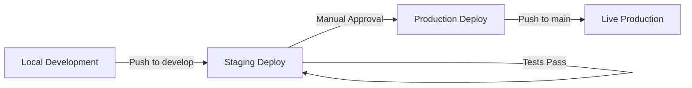

# MiniMe Deployment Guide

**Last Updated:** February 12, 2026  
**Target Environment:** Production  
**Deployment Strategy:** Vercel (Recommended) or Kubernetes

---

## 🎯 Quick Start

### Option A: Vercel (Recommended for MVP)

**Prerequisites:**
- Vercel account
- GitHub repository
- Domain nameready (www.tryminime.com, app.tryminime.com)

**Steps:**

1. **Install Vercel CLI**
   ```bash
   npm install -g vercel
   ```

2. **Login to Vercel**
   ```bash
   vercel login
   ```

3. **Link Project**
   ```bash
   cd website
   vercel link
   ```

4. **Set Environment Variables**
   ```bash
   vercel env add NEXT_PUBLIC_API_URL production
   vercel env add NEXT_PUBLIC_STRIPE_PUBLISHABLE_KEY production
   # Add all required env vars
   ```

5. **Deploy to Production**
   ```bash
   vercel --prod
   ```

**GitHub Integration:**
- Connect GitHub repository in Vercel dashboard
- Auto-deploy on push to `main` (production)
- Auto-deploy on push to `develop` (staging/preview)

---

### Option B: Kubernetes (Advanced)

**Prerequisites:**
- Kubernetes cluster (GKE, EKS, AKS,or self-hosted)
- `kubectl` configured
- Docker registry (GitHub Container Registry or Docker Hub)

**Steps:**

1. **Build Docker Image**
   ```bash
   cd website
   docker build -t ghcr.io/yourusername/minime-frontend:latest .
   ```

2. **Push to Registry**
   ```bash
   docker push ghcr.io/yourusername/minime-frontend:latest
   ```

3. **Create Namespace**
   ```bash
   kubectl create namespace minime
   ```

4. **Apply Kubernetes Manifests**
   ```bash
   kubectl apply -f infra/k8s/configmap.yaml
   kubectl apply -f infra/k8s/secrets.yaml
   kubectl apply -f infra/k8s/frontend-deployment.yaml
   kubectl apply -f infra/k8s/frontend-service.yaml
   kubectl apply -f infra/k8s/ingress.yaml
   ```

5. **Verify Deployment**
   ```bash
   kubectl get pods -n minime
   kubectl get svc -n minime
   kubectl get ingress -n minime
   ```

---

## 🔧 Environment Variables

### Production (.env.production or Vercel)

```bash
# API Configuration
NEXT_PUBLIC_API_URL=https://api.tryminime.com

# Stripe (Production Keys)
NEXT_PUBLIC_STRIPE_PUBLISHABLE_KEY=pk_live_XXXXXXXXXXXXX

# OAuth (Production Credentials)
NEXT_PUBLIC_GITHUB_CLIENT_ID=XXXXXXXXXXXXX
NEXT_PUBLIC_GOOGLE_CLIENT_ID=XXXXXXXXXXXXX

# Feature Flags
NEXT_PUBLIC_ENABLE_ANALYTICS=true
NEXT_PUBLIC_ENABLE_BETA_FEATURES=false

# Monitoring
NEXT_PUBLIC_SENTRY_DSN=https://xxxxx@sentry.io/xxxxx
```

### Staging

```bash
NEXT_PUBLIC_API_URL=https://staging-api.tryminime.com
NEXT_PUBLIC_STRIPE_PUBLISHABLE_KEY=pk_test_XXXXXXXXXXXXX
# ... same as production but with staging/test values
```

---

## 🌐 Domain Configuration

### DNS Records

**For Vercel:**
1. Add domain in Vercel dashboard
2. Configure DNS records:

```
Type: A
Name: @
Value: 76.76.21.21

Type: CNAME
Name: www
Value: cname.vercel-dns.com

Type: CNAME
Name: app
Value: cname.vercel-dns.com
```

**For Kubernetes + NGINX Ingress:**
```
Type: A
Name: @
Value: <your-ingress-ip>

Type: A
Name: www
Value: <your-ingress-ip>

Type: A
Name: app
Value: <your-ingress-ip>
```

### SSL/TLS Certificates

**Vercel:** Automatic (Let's Encrypt)

**Kubernetes:** Install cert-manager
```bash
kubectl apply -f https://github.com/cert-manager/cert-manager/releases/download/v1.13.0/cert-manager.yaml

# Create ClusterIssuer
kubectl apply -f infra/k8s/cert-issuer.yaml
```

---

## 🚀 CI/CD Pipelines

### GitHub Actions Workflows

**1. Frontend CI** (`.github/workflows/frontend-ci.yml`)
- Triggers: PRs to `main` or `develop`
- Actions: Lint, TypeScript check, build, Docker build

**2. Deploy Staging** (`.github/workflows/deploy-staging.yml`)
- Triggers: Push to `develop`
- Actions: Build, deploy to Vercel preview

**3. Deploy Production** (`.github/workflows/deploy-production.yml`)
- Triggers: Push to `main` (or manual)
- Actions: Build, deploy to Vercel production

### Required GitHub Secrets

```
VERCEL_TOKEN          # Vercel API token
NEXT_PUBLIC_API_URL_PROD    # Production API URL
NEXT_PUBLIC_API_URL_STAGING # Staging API URL
NEXT_PUBLIC_STRIPE_PUBLISHABLE_KEY_PROD  # Production Stripe key
NEXT_PUBLIC_STRIPE_PUBLISHABLE_KEY_TEST  # Test Stripe key
SLACK_WEBHOOK_URL     # For deployment notifications (optional)
```

---

## 🧪 Testing Deployment

### Pre-Deployment Checklist

- [ ] All tests passing (`npm run test`)
- [ ] TypeScript errors resolved
- [ ] Build successful (`npm run build`)
- [ ] Environment variables configured
- [ ] SSL certificate valid
- [ ] OAuth callbacks updated

### Post-Deployment Verification

```bash
# Check site is accessible
curl -I https://www.tryminime.com

# Test API connection
curl https://www.tryminime.com/api/health

# Check SSL certificate
openssl s_client -connect www.tryminime.com:443 -servername www.tryminime.com

# Performance audit
npx lighthouse https://www.tryminime.com --output html --output-path ./lighthouse-report.html
```

### Manual Tests

1. **Landing Page**
   - [ ] Hero section renders
   - [ ] All CTAs functional
   - [ ] Images load correctly
   - [ ] Mobile responsive

2. **Authentication**
   - [ ] OAuth login (GitHub)
   - [ ] OAuth login (Google)
   - [ ] Session persists
   - [ ] Logout works

3. **Dashboard**
   - [ ] All 7 dashboards load
   - [ ] Real-time data updates
   - [ ] Graphs render correctly

4. **Billing**
   - [ ] Pricing page loads
   - [ ] Stripe checkout works
   - [ ] Subscription management functional

5. **Waitlist**
   - [ ] Form validation works
   - [ ] Submission successful
   - [ ] Confirmation displayed

---

## 📊 Monitoring

### Production Monitoring Stack

**Recommended Tools:**
- **Uptime:** Vercel Analytics (built-in) or UptimeRobot
- **Errors:** Sentry
- **Analytics:** Google Analytics or Plausible
- **Performance:** Vercel Speed Insights

### Health Check Endpoints

```
GET /api/health
GET /api/status
```

### Alerts

Configure alerts for:
- Deployment failures
- Error rate > 1%
- Response time > 2s
- SSL certificate expiry (< 30 days)
- Uptime < 99.9%

---

## 🔄 Deployment Workflow

### Development → Staging → Production



**Process:**
1. Developer creates feature branch
2. Open PR to `develop`
3. CI runs (lint, test, build)
4. Merge to `develop` → Auto-deploy to staging
5. QA tests on staging
6. Create PR from `develop` to `main`
7. Merge to `main` → Auto-deploy to production

---

## 🛠️ Troubleshooting

### Build Failures

**Error:** `Module not found`
- **Fix:** Run `npm ci` to reinstall dependencies

**Error:** `TypeScript errors`
- **Fix:** Run `npx tsc --noEmit` to check errors locally

**Error:** `Docker build fails`
- **Fix:** Check `.dockerignore` and rebuild

### Deployment Issues

**Site not accessible:**
1. Check DNS propagation: `dig www.tryminime.com`
2. Verify SSL certificate: `curl -I https://www.tryminime.com`
3. Check deployment logs in Vercel dashboard

**OAuth not working:**
1. Update OAuth callback URLs in provider settings
2. Verify client IDs in environment variables
3. Check CORS configuration

**API calls failing:**
1. Verify `NEXT_PUBLIC_API_URL` is correct
2. Check CORS headers on backend
3. Inspect network tab in browser DevTools

---

## 📦 Rollback Strategy

### Vercel Rollback

```bash
# List recent deployments
vercel list

# Rollback to specific deployment
vercel rollback <deployment-url>
```

**Or** via Vercel dashboard:
1. Go to Deployments
2. Find previous stable deployment
3. Click "Promote to Production"

### Kubernetes Rollback

```bash
# Rollback to previous version
kubectl rollout undo deployment/minime-frontend -n minime

# Rollback to specific revision
kubectl rollout undo deployment/minime-frontend --to-revision=2 -n minime

# Check rollout status
kubectl rollout status deployment/minime-frontend -n minime
```

---

## 🎯 Performance Optimization

### Next.js Optimizations

1. **Image Optimization**
   - Use `next/image` component
   - Lazy load images
   - Serve WebP format

2. **Code Splitting**
   - Dynamic imports for large components
   - Route-based splitting (automatic)

3. **Caching**
   - Revalidate static pages (ISR)
   - Edge caching via Vercel
   - API response caching

### Lighthouse Targets

- **Performance:** > 90
- **Accessibility:** > 95
- **Best Practices:** > 95
- **SEO:** > 95

---

## 📋 Post-Launch Checklist

- [ ] Production deployment successful
- [ ] SSL certificate installed and valid
- [ ] All environment variables set
- [ ] OAuth providers configured
- [ ] Monitoring/alerting enabled
- [ ] Backup strategy in place
- [ ] Domain DNS propagated
- [ ] CDN caching working
- [ ] Error tracking (Sentry) configured
- [ ] Analytics tracking installed
- [ ] Performance audit passed (Lighthouse > 90)
- [ ] Load testing completed
- [ ] Security headers configured
- [ ] GDPR/privacy compliance verified
- [ ] Documentation updated

---

## 🔒 Security Checklist

- [ ] HTTPS enforced
- [ ] Security headers (CSP, HSTS, etc.)
- [ ] OAuth secrets rotated
- [ ] API rate limiting enabled
- [ ] Input validation on all forms
- [ ] SQL injection prevention
- [ ] XSS protection
- [ ] CSRF tokens implemented
- [ ] Dependencies updated (no critical vulnerabilities)

---

## 📞 Support

**Deployment Issues:** ops@tryminime.com  
**Security Issues:** security@tryminime.com  
**General Questions:** hello@tryminime.com

---

**Status:** ✅ Deployment infrastructure ready  
**Environment:** Vercel (Recommended) or Kubernetes  
**Last Tested:** February 12, 2026
